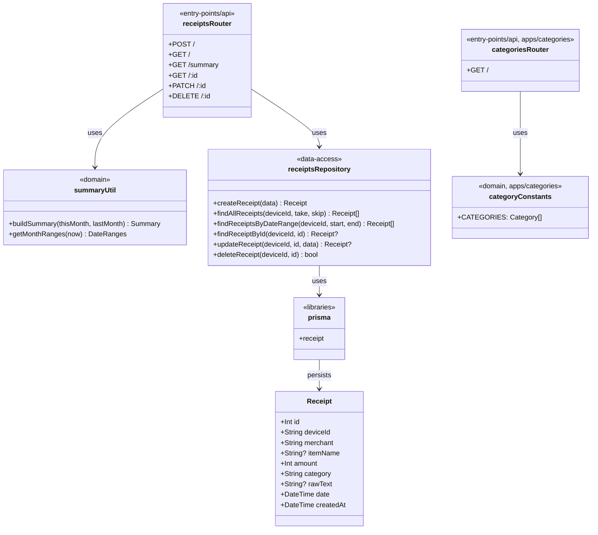
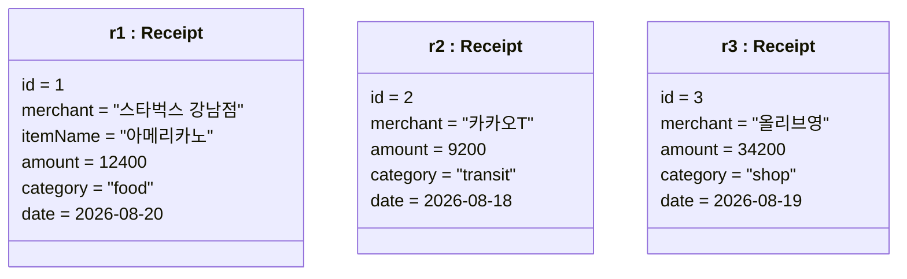
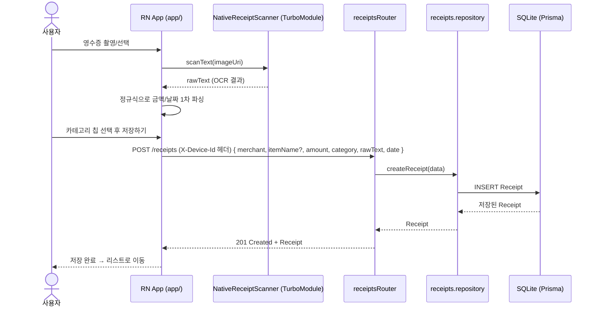
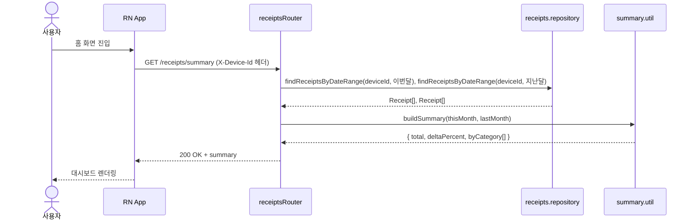
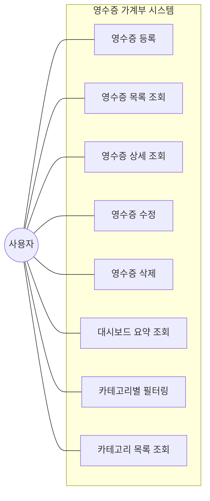
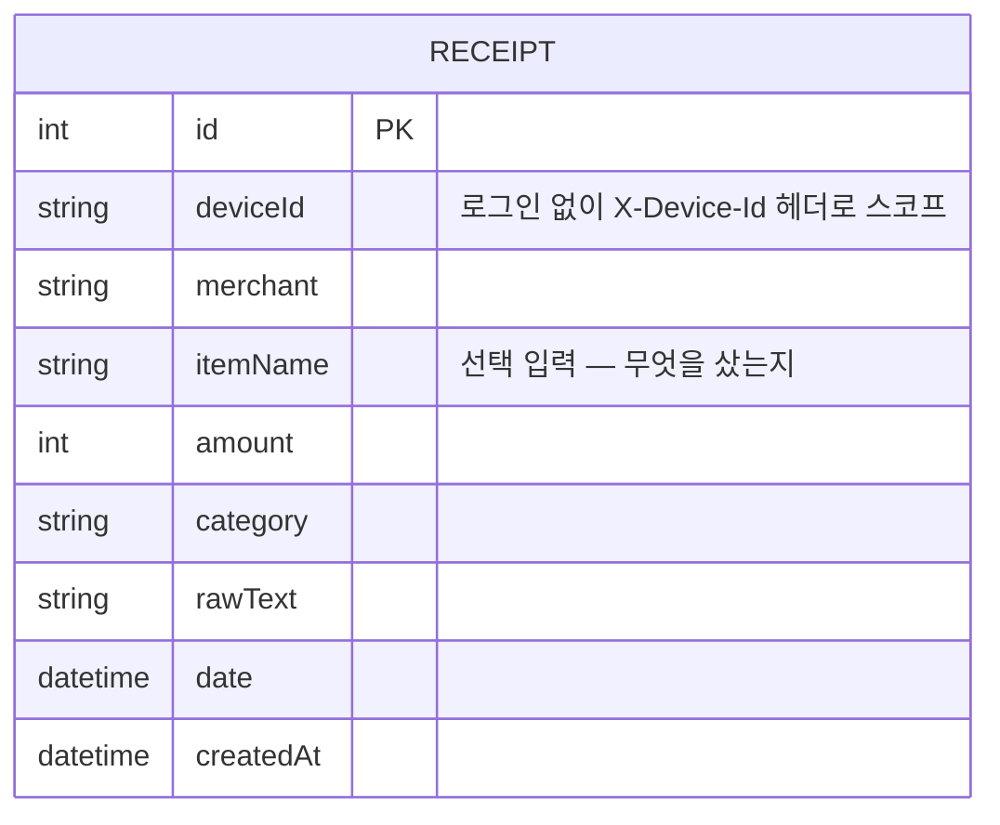
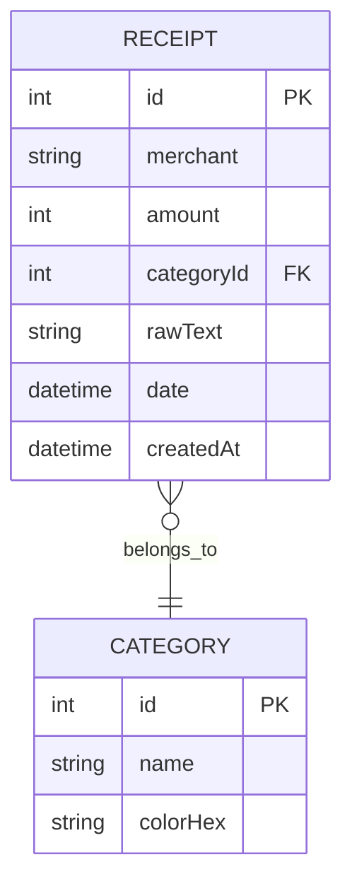

# 아키텍처 문서

`receipt-scanner-server`의 구조/데이터/흐름을 정리한 다이어그램 모음.

## 1. 구조 다이어그램 (Class Diagram)

`entry-points`(라우팅) → `domain`(순수 로직) / `data-access`(DB 접근) → `libraries`(Prisma 싱글턴) → `Receipt` 순으로 의존.

`categoriesRouter`는 `receipts`와 별개 컴포넌트(`apps/categories/`)로 분리 — DB에 의존하지 않는 정적 메타데이터(라벨/색상)만 반환하므로 `data-access` 계층 없이 `entry-points`+`domain`만 존재.

## 2. 객체 다이어그램 (Object Diagram)

실제 저장되는 데이터 예시.

## 3. 행위 다이어그램 (Sequence Diagram)

### 3-1. 영수증 등록 흐름 (앱 + 네이티브 + 백엔드 전체 연결)

### 3-2. 홈 대시보드 조회 흐름

## 4. 유스케이스 다이어그램

## 5. ERD

향후 확장 시(카테고리를 별도 테이블로 정규화):

